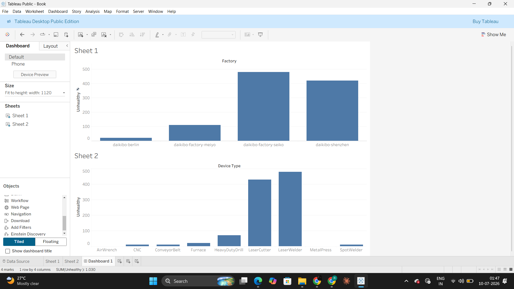

# 📊 Tableau Dashboard Project

## Overview
This repository contains an interactive Tableau dashboard developed to analyze and visualize data using Tableau Desktop.

The dashboard presents key insights through charts, graphs, filters, and KPIs, enabling users to explore trends and make data-driven decisions.

---

## Features

- Interactive dashboard
- Dynamic filters
- KPI cards
- Trend analysis
- Comparative charts
- User-friendly visualization

---

## Tools Used

- Tableau Desktop
- JSON File Dataset
- GitHub

---

## Repository Structure

```
.
├── Book.twbx
├── daikibo-telemetry-data.json.zip
├── screenshots/
└── README.md
```

---

## Files

### Book.twbx
Tableau workbook containing all dashboards, worksheets, and visualizations.

### daikibo-telemetry-data.json.zip
Contains the source data used for creating the dashboard.

### Screenshots
Preview images of the dashboard.

---

## Dashboard Preview

(Add your screenshot here)



---

## How to Open

1. Clone this repository

```
git clone https://github.com/yourusername/Tableau-Dashboard.git
```

2. Open **Book.twbx** using Tableau Desktop.

3. If prompted, reconnect the data source located inside the **dataset** folder.

---

## Skills Demonstrated

- Data Visualization
- Dashboard Design
- Data Cleaning
- Business Intelligence
- Tableau
- KPI Analysis

---

## Author

**Darsh Sharma**

B.Tech Computer Science and Engineering
